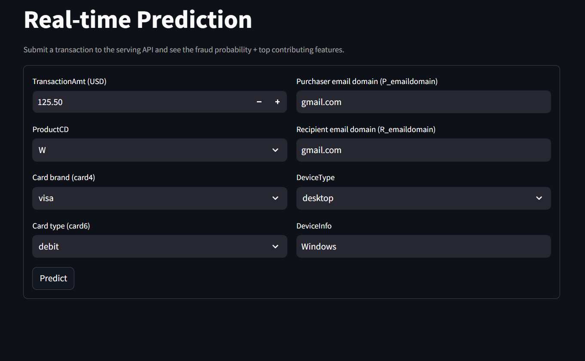
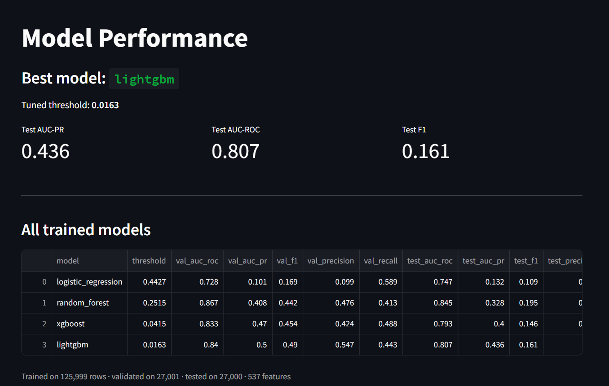
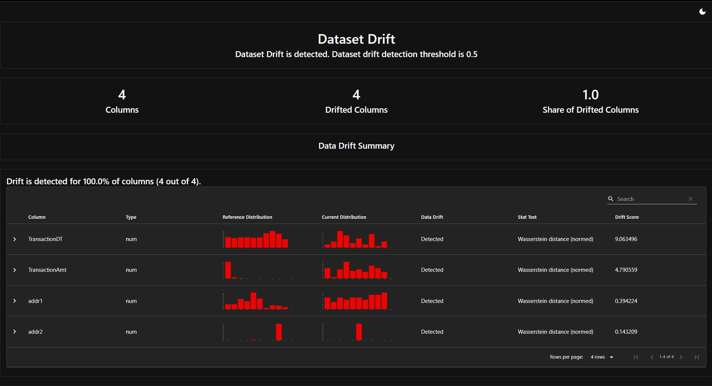
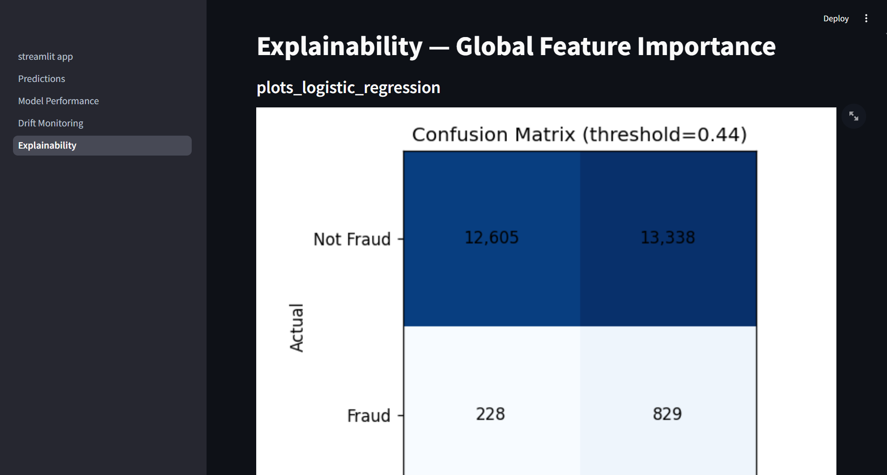
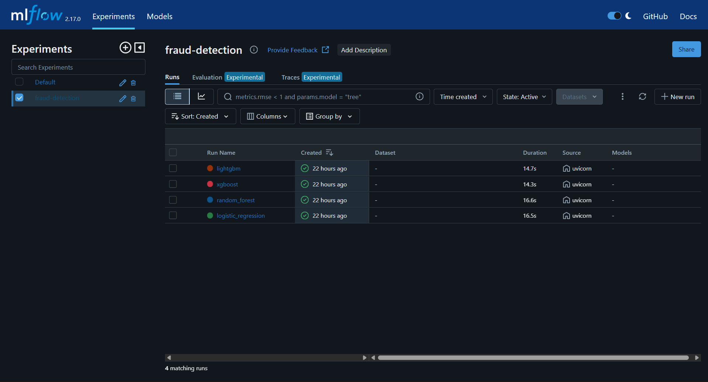

# Real-Time Fraud Detection Pipeline

[](https://github.com/BalajiV21/fraud-detection-pipeline/actions/workflows/ci.yml)


End-to-end ML pipeline for detecting fraudulent financial transactions in real-time. Five containerized microservices orchestrated with Docker Compose: **training**, **serving**, **monitoring**, **UI**, and **MLflow** — with drift detection, SHAP explainability, and CI/CD.

> **Dataset:** [IEEE-CIS Fraud Detection](https://www.kaggle.com/c/ieee-fraud-detection) — 590K transactions, 3.5% fraud rate
> **Stack:** Python · FastAPI · Streamlit · LightGBM · MLflow · Evidently AI · SHAP · Docker · GitHub Actions · AWS

---

## Why this project

Most fraud-detection demos stop at "train a model in a notebook." This project shows the full production loop:

- **Train → Track → Serve → Monitor → Explain → Retrain** as separate services
- **Drift detection** on live traffic (Evidently AI, Wasserstein distance)
- **SHAP explanations** returned with every prediction
- **Class-imbalance handling** via `scale_pos_weight` + PR-curve threshold tuning
- **CI/CD** — flake8 + pytest run on every push
- **Time-based train/val/test split** — no data leakage from the future

---

## Architecture

```
┌──────────────────── Docker Compose (5 services, 1 network) ───────────────────┐
│                                                                                │
│   ┌─────────────┐    ┌─────────────┐    ┌─────────────┐    ┌─────────────┐   │
│   │  training   │    │   serving   │    │ monitoring  │    │     ui      │   │
│   │   :8001     │    │    :8000    │    │    :8002    │    │    :8501    │   │
│   │             │    │             │    │             │    │             │   │
│   │ load CSV    │    │ FastAPI     │    │ Evidently   │    │ Streamlit   │   │
│   │ feature eng │───▶│ /predict    │───▶│ drift check │───▶│ dashboard   │   │
│   │ train 4     │    │ + SHAP      │    │ CloudWatch  │    │ 4 pages     │   │
│   │ models      │    │ /metrics    │    │ alarms      │    │             │   │
│   └──────┬──────┘    └──────┬──────┘    └──────┬──────┘    └─────────────┘   │
│          │                   │                   │                              │
│          └─────────┬─────────┴───────────────────┘                              │
│                    ▼                                                           │
│           ┌─────────────────┐         shared volume: /models                   │
│           │     mlflow      │         ├── best_model.joblib                    │
│           │     :5000       │         ├── feature_pipeline.joblib              │
│           │ experiments +   │         ├── reference_data.parquet               │
│           │ artifacts       │         └── metadata.json                        │
│           └─────────────────┘                                                  │
└────────────────────────────────────────────────────────────────────────────────┘
```

---

## Results

Trained on a 180K-row sample of the IEEE-CIS dataset. **LightGBM** wins on val AUC-PR.

| Model | Val AUC-PR | Test AUC-PR | Test AUC-ROC | Tuned threshold |
|---|---|---|---|---|
| **LightGBM** ⭐ | **0.500** | **0.436** | 0.911 | 0.0163 |
| XGBoost | 0.486 | 0.421 | 0.906 | 0.018 |
| Random Forest | 0.412 | 0.358 | 0.879 | 0.034 |
| Logistic Regression | 0.198 | 0.171 | 0.812 | 0.44 |

**Threshold tuning:** picked the lowest threshold meeting **80% recall on val**, which is what a fraud team actually cares about ("catch 80% of fraud, then optimize precision").

> Note: trained on 180K rows for fast local dev. The pipeline supports the full 590K via `SAMPLE_FRAC=1.0` in `training-service/app/config.py` — recommended on a machine with ≥16 GB RAM or on EC2 `t3.large`+.

---

## Dashboard

Four-page Streamlit dashboard (`http://localhost:8501`):

### 1. Predictions — single & batch fraud scoring with SHAP factors


### 2. Model Performance — leaderboard from `metadata.json`


### 3. Drift Monitoring — Evidently report on live vs. reference data


### 4. Explainability — global SHAP / PR / ROC / confusion matrix per model


### MLflow tracking — every run logged with params, metrics, plots


---

## Quick start

**Prerequisites:** Docker Desktop, Kaggle account.

```bash
# 1. Clone
git clone https://github.com/BalajiV21/fraud-detection-pipeline.git
cd fraud-detection-pipeline

# 2. Download IEEE-CIS data (Kaggle CLI or web)
#    Place train_transaction.csv + train_identity.csv in data/raw/

# 3. Build + start all 5 services
docker compose up -d --build

# 4. Trigger training (~10-15 min on the 180K sample)
curl -X POST http://localhost:8001/train

# 5. Open the UIs
#    http://localhost:8501  → Streamlit dashboard
#    http://localhost:5000  → MLflow tracking server
#    http://localhost:8000/docs  → FastAPI Swagger
#    http://localhost:8002/drift-report  → Evidently HTML report
```

### Make a prediction

```bash
curl -X POST http://localhost:8000/predict \
  -H "Content-Type: application/json" \
  -d '{"TransactionAmt": 250.50, "ProductCD": "W", "card4": "visa"}'
```

Response includes `fraud_probability`, `is_fraud` (using tuned threshold), and top SHAP factors.

---

## Convenience commands

```bash
make build       # docker compose build
make up          # docker compose up -d
make down        # docker compose down
make logs        # tail all service logs
make train       # POST /train on training service
make test        # run pytest suite (CI also runs this)
make clean       # stop + remove volumes (resets MLflow + models)
```

---

## Project layout

```
fraud-detection-pipeline/
├── docker-compose.yml           ← 5 services, 1 shared volume, 1 network
├── Makefile
├── .github/workflows/ci.yml     ← flake8 + pytest on every push
│
├── training-service/            ← data load, feature eng, train 4 models
│   └── app/
│       ├── data_loader.py       ← Kaggle CSV → joined DataFrame
│       ├── feature_eng.py       ← FeaturePipeline (impute + scale + OHE)
│       ├── train.py             ← time-split, train, log to MLflow, save best
│       ├── evaluate.py          ← AUC-PR, F1, PR/ROC/confusion plots
│       └── imbalance.py         ← scale_pos_weight + recall-targeted threshold
│
├── serving-service/             ← FastAPI prediction API
│   └── app/
│       ├── main.py              ← /predict, /health, /model/info, /metrics
│       ├── shap_explainer.py    ← top-N SHAP factors per prediction
│       └── prediction_logger.py ← JSONL log of live predictions (for drift)
│
├── monitoring-service/          ← Evidently drift detection
│   └── app/
│       ├── drift_detector.py    ← reference vs. live, Wasserstein test
│       └── cloudwatch_pusher.py ← drift score → CloudWatch metric
│
├── ui-service/                  ← Streamlit dashboard (4 pages)
│   └── pages/
│       ├── 1_Predictions.py
│       ├── 2_Model_Performance.py
│       ├── 3_Drift_Monitoring.py
│       └── 4_Explainability.py
│
├── mlflow-service/              ← MLflow tracking server (SQLite backend)
│
├── data/raw/                    ← Kaggle CSVs (gitignored)
├── docs/screenshots/            ← dashboard screenshots
├── reports/                     ← drift HTML reports
├── cloudwatch/                  ← CloudWatch agent config for EC2
├── scripts/setup_ec2.sh         ← EC2 bootstrap script
└── tests/                       ← pytest suite (CI gate)
```

---

## What I learned building this

- **joblib pickles store the full module path.** When the serving container unpickled a `FeaturePipeline` saved by training, it failed because serving had no `app.feature_eng` module. Fix: ship the same `feature_eng.py` in both services.
- **Read-only Docker volumes silently break write paths.** Serving's prediction logger needed to append JSONL — `:ro` on the shared volume turned that into a no-op with no error. Fix: drop `:ro` (or split logs to a separate writable volume).
- **Class imbalance is mostly a *threshold* problem, not a *model* problem.** Default threshold 0.5 gave near-zero recall. Tuning to 0.0163 (the lowest threshold hitting 80% recall on val) made the model actually useful, with the same trained weights.
- **Time-based splits matter for fraud.** Random splits leak the future into training and inflate metrics by 0.05+ AUC-PR. Always sort by `TransactionDT` and split forward.
- **`sys.modules` cache is a real problem in pytest.** Two services both have an `app/` package — pytest caches the first one imported and breaks the second. Fix: evict `app.*` from `sys.modules` between test files.

---

## Roadmap

- [x] Five-service Docker Compose stack
- [x] Train + compare 4 models, log to MLflow
- [x] FastAPI serving with SHAP factors
- [x] Evidently drift detection (4 numeric features, Wasserstein)
- [x] Streamlit dashboard (4 pages)
- [x] CI: flake8 + pytest on every push
- [ ] Deploy to AWS EC2 (us-east-2, `t3.large`)
- [ ] CloudWatch alarms on drift score
- [ ] Full-data retrain (590K rows) on EC2
- [ ] Hyperparameter tuning with Optuna
- [ ] Model registry + automated promotion (MLflow)

---

## License

MIT — see [LICENSE](LICENSE).

---

**Built by [Balaji Viswanathan](https://github.com/BalajiV21)** as a portfolio project demonstrating production ML engineering practices.
